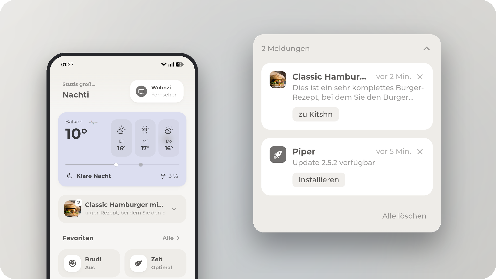

<div align="center">

# Notification Card

Everything Home Assistant wants to tell you, in one card.

[](https://hacs.xyz)
[](https://www.home-assistant.io)

<picture>
  <source media="(prefers-color-scheme: dark)" srcset="images/dark.png">
  
</picture>

</div>

## Install

In HACS: three dot menu > *Custom repositories* > add
`https://github.com/hazymorning/Notification-Card` as type **Dashboard**, then
install *Notification Card*.

<details>
<summary>Manual install</summary>

Copy `dist/notification-card.js` to `config/www/` and add the resource:

```yaml
url: /local/notification-card.js
type: module
```

</details>

## Use

Add a card to your dashboard, pick **Notification Card**, done. In YAML:

```yaml
type: custom:notification-card
```

> [!TIP]
> That is already a working card. System notifications, repairs and pending
> updates are picked up on their own, and everything below can be clicked
> together in the visual editor instead of written by hand.

| Option | Default | |
| --- | --- | --- |
| `hide_when_empty` | `true` | Hide the card while there is nothing to show |
| `updates` | `true` | Include `update.` entities with a pending update |
| `repairs` | `true` | Include open repairs from Settings > System > Repairs |
| `entities` | `[]` | Extra entities, as ids or as objects |
| `label` | | Include every entity carrying this Home Assistant label |
| `audience` | | Limit a single source to certain people |
| `css` | | A stylesheet for the card, see *Styling* |

<details>
<summary><b>Entities</b>: per entity options, auto detection</summary>

```yaml
entities:
  - sensor.dwd_weather_warnings
  - entity: calendar.family
    name: Family
  - entity: sensor.doorbell
    type: generic
    icon: mdi:doorbell
    actions:
      - label: Open
        tap_action:
          action: perform-action
          perform_action: lock.open
          target:
            entity_id: lock.front_door
```

| Key | |
| --- | --- |
| `entity` | Entity id, required |
| `type` | `auto`, `calendar`, `update`, `alarm`, `alert`, `dwd`, `recipe` or `generic` |
| `name`, `icon` | Replace title and icon |
| `image` | Image URL or attribute path, e.g. `recipe.image` |
| `tap_action` | Runs when the row is tapped, same syntax as other cards |
| `actions` | Buttons in the row, each with `label` and `tap_action` |

With `type: auto` the card decides by itself: calendar entities show a running
event, update entities get an install button, alarm panels show up while they
are triggered, pending or arming, alert entities while they are on, DWD
warnings become one row per warning, anything with a `recipe` attribute shows
the dish. The rest is read as a plain entity and only shows up while it is
`on`, `active` or a number above zero. `type: generic` also lets text states
through.

</details>

<details>
<summary><b>Audience</b>: who sees what</summary>

`only` lists who sees a source, `except` lists who doesn't. Keys are `system`,
`updates`, `repairs` or an entity id.

```yaml
audience:
  system:
    only:
      - person.anna
  sensor.dwd_weather_warnings:
    except:
      - person.kid
```

People are matched through the user account linked in *Settings > People*. The
filter is off while the dashboard editor is open, so you can still see what you
are configuring.

</details>

<details>
<summary><b>Styling</b></summary>

Sizes, shapes and timings are variables. Set them in `css`, together with
whatever else you want to change.

```yaml
css: |
  :host { --nc-radius: 20px; --nc-pad: 16px; }
  .row { border: 1px solid var(--divider-color); }
```

Variables: `--nc-pad`, `--nc-gap`, `--nc-gap-s`, `--nc-radius`,
`--nc-radius-s`, `--nc-tile`, `--nc-tile-s`, `--nc-icon`, `--nc-muted`,
`--nc-quiet`, `--nc-ease`, `--nc-time`.

Classes: `.head`, `.tile`, `.badge`, `.title`, `.msg`, `.ebar`, `.count`,
`.list`, `.row`, `.rtile`, `.body`, `.when`, `.x`, `.act`, `.foot`, `.clear`.

</details>

> [!NOTE]
> System notifications, updates and repairs are dismissed in Home Assistant
> itself. Everything else is only dismissed on the device you are looking at,
> and comes back when its content changes. Repairs need an admin account, so
> they stay hidden for everyone else.
